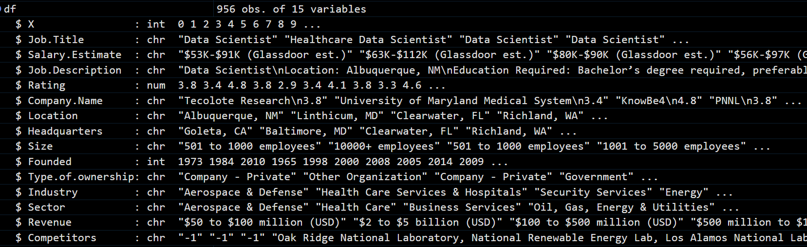
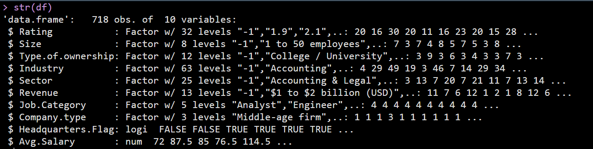
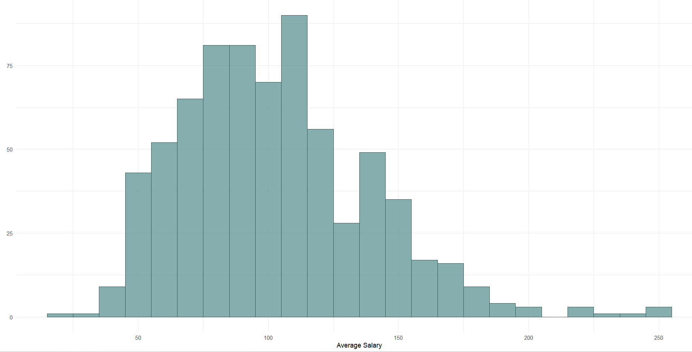
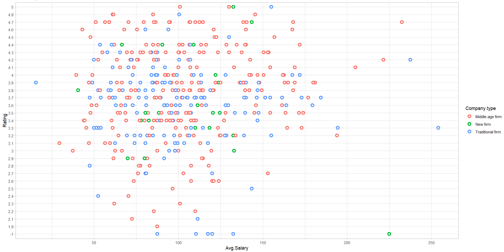
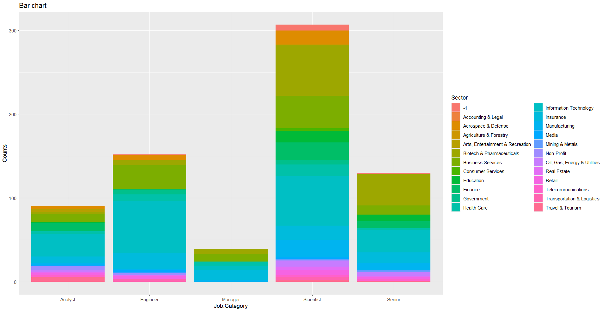
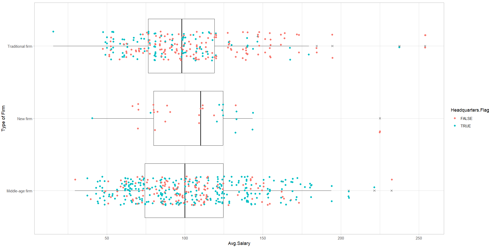

# Data Professional Salary Analysis-R

## Outline
1. Data Cleaning - Feature Extarction and Feature Selecction
2. Visualization
3. Hypothesis Testing

## Data Cleaning
#### Before Pre-processing:

#### Pre-Processed Data:

## Visualization
#### Salary Distribution:

#### Salary vs Rating:

#### Job Category in Sectors:

#### Outlier in Salary data:

## Hypothesis Testing
We tested two hypothesis.
#### Alternate Hypothesis 1:
Employee are paid more when they are working at headquarters.

**RESULT:** Fail to reject null hypothesis

#### Alternate Hypothesis 2:
Traditional firms has a higher pay roll as compared to Middle Level.

**RESULT:** Fail to reject null hypothesis

